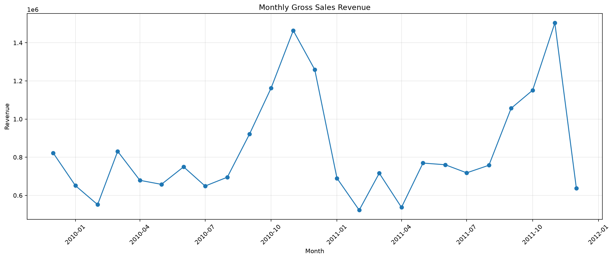
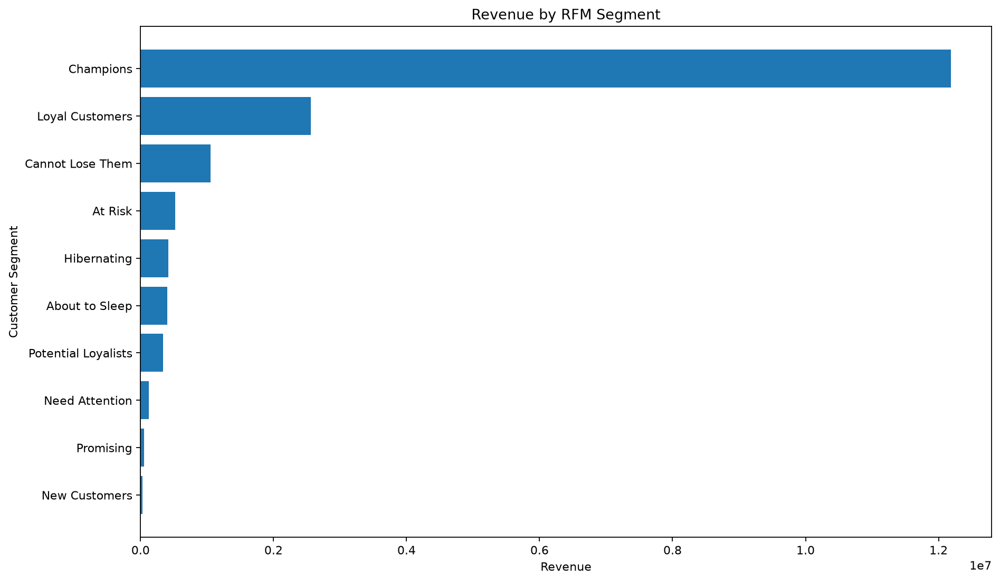
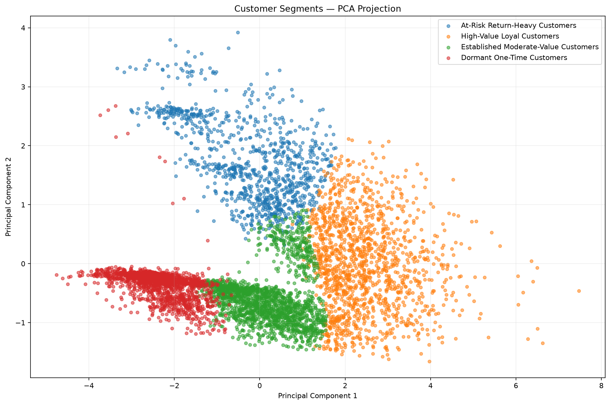
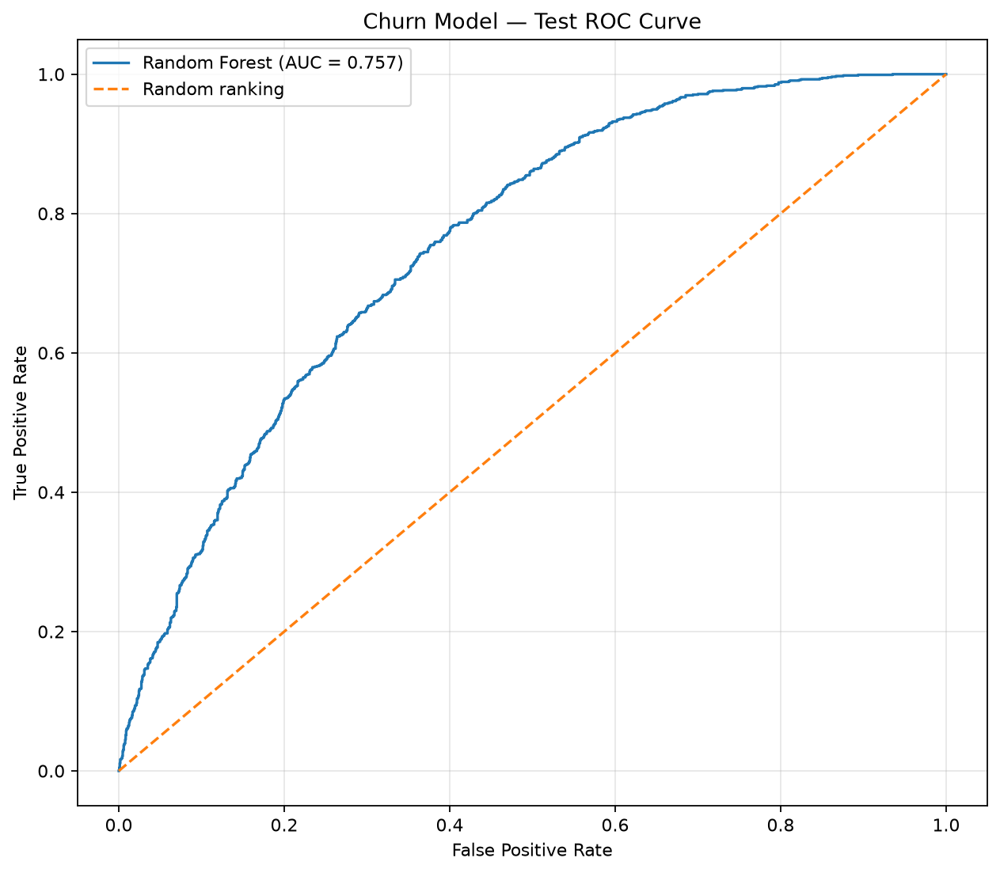
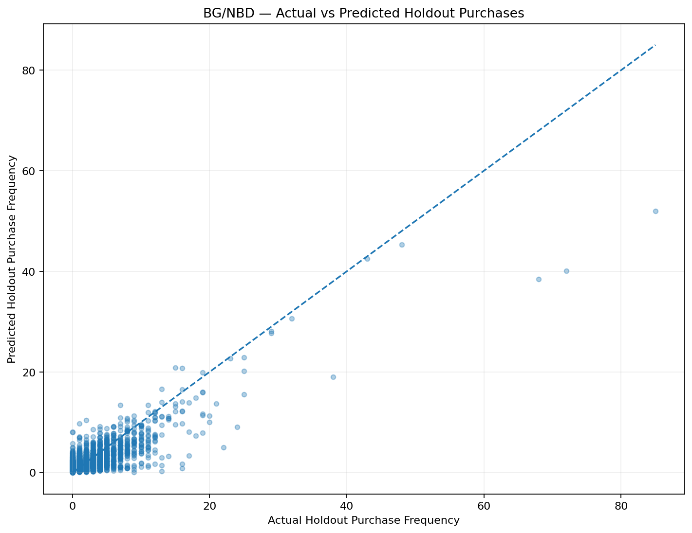
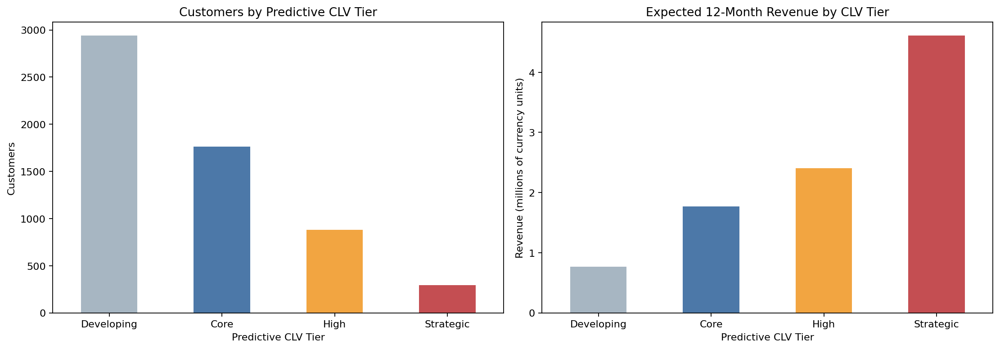
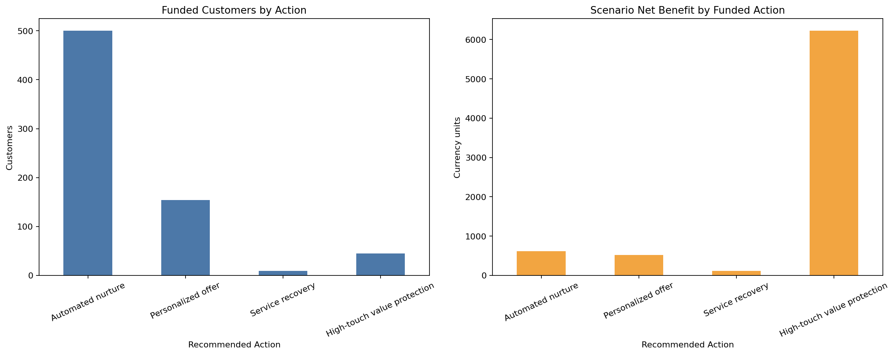
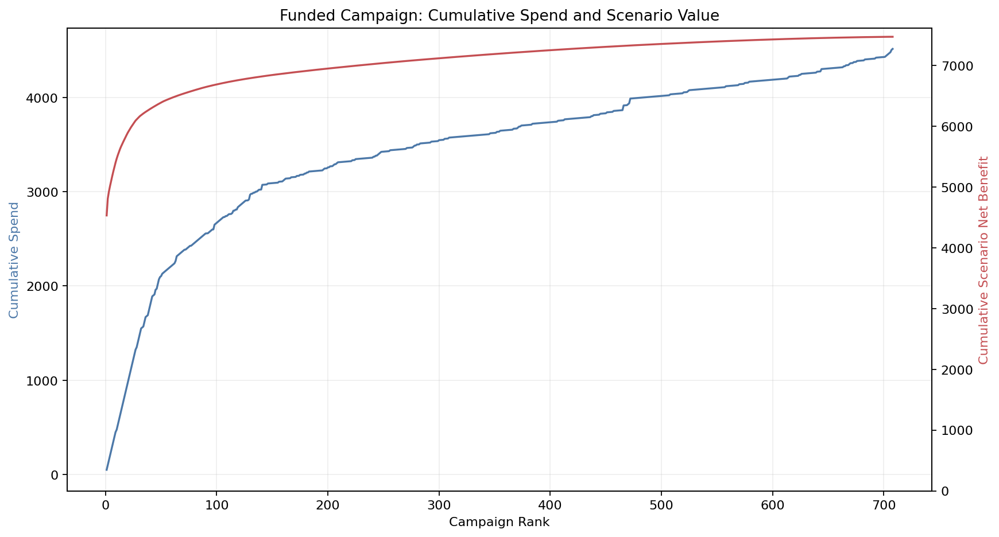

# Customer Intelligence Analytics

## Consolidated Business Report

**Dataset:** Online Retail II  
**Observed transaction window:** 1 December 2009 to 9 December 2011  
**Customer decision date:** 10 December 2011  
**Reporting convention:** All financial values are shown in generic currency units. Historical revenue, predictive revenue, and scenario contribution benefit are different measures and are never added together.

## Executive summary

This project turns two years of non-contractual retail transactions into an integrated customer decision system:

`transactions -> descriptive segments -> churn risk -> predictive revenue CLV -> constrained retention actions`

The analysis covers 1,067,371 raw transaction lines and produces customer-level intelligence for 5,878 identifiable purchasing customers. The central business finding is concentration. The top 1% of customers generated 32.02% of known-customer historical revenue; 1,423 RFM Champions generated 68.92%; and the 294 customers in the forward-looking Strategic CLV tier represent 48.23% of expected 12-month revenue.

The churn model adds useful prioritization rather than a universal campaign rule. On a fully held-out September 2011 cohort it achieved ROC-AUC 0.7569, and the top 5% of customers ranked by churn probability had a 74.10% observed churn rate, 1.89 times the test baseline. Its validation-selected 0.31 classification threshold deliberately favors recall and flags 67.75% of the test cohort, so the threshold is not used as an instruction to spend on every predicted churner.

The CLV models estimate 9.557 million of expected revenue during the next 12 months. This is a forward-looking point estimate, not the 17.685 million already observed from known customers and not profit. BG/NBD validation was well calibrated in aggregate: 7,960.962 predicted purchases versus 8,111 actual purchases in a 191-day holdout, an error of -1.85%. Customer-level error remained material, so CLV is most defensible for ranking, portfolio planning, and tiering.

Under the default retention scenario, 770 customers have positive scenario economics and meet the 20% policy risk floor. A binary allocation selects 708 customers, spends 4,515 of a 10,000 budget, and produces 11,989.49 of scenario contribution benefit and 7,474.49 of scenario net benefit. These figures depend on assumed recoverable shares; they are not measured causal uplift. Automated nurture reaches its 500-customer capacity, while total budget and total campaign capacity remain slack. Additional budget alone would therefore not expand the plan.

### Decision scorecard

| Business question | Verified result | Decision implication |
|---|---:|---|
| How much valid positive sales revenue is observed? | 20.914 million | Use for overall sales reporting; 84.56% can be linked to known customers. |
| Where is historical customer value concentrated? | Champions: 24.21% of customers, 68.92% of customer revenue | Protect high-value relationships, but use risk and future value to avoid blanket incentives. |
| Can churn risk be ranked out of time? | Test ROC-AUC 0.7569; top-5% lift 1.89x | Use probabilities for ordering and decision economics, not as causal scores. |
| Is the purchase model calibrated? | Holdout aggregate error -1.85% | Suitable for portfolio forecasts; customer-level forecasts remain uncertain. |
| How much forward revenue is expected? | 9.557 million over 12 months | Keep separate from 17.685 million of historical known-customer revenue. |
| What does the default campaign fund? | 708 customers; cost 4,515; scenario net benefit 7,474.49 | Pilot with holdouts and operational eligibility checks before activation. |

Primary reconciled sources: [data-understanding KPIs](data_understanding_kpis.json), [RFM summary](rfm_summary.json), [churn test metrics](churn_final_test_metrics.json), [CLV model summary](clv_model_summary.json), and [retention-engine summary](retention_engine_summary.json).

## 1. Data foundation and quality

### Analytical scope

The source contains 1,067,371 rows, 53,628 invoice identifiers, 5,305 product identifiers, 5,942 known customer identifiers, and 43 countries. The dates span 1 December 2009 through 9 December 2011. Exact deduplication and explicit business rules produce four datasets for different purposes:

| Dataset stage | Rows | Intended use |
|---|---:|---|
| Raw source | 1,067,371 | Audit baseline |
| Deduplicated transactions | 1,055,238 | Complete transaction and data-quality analysis |
| Valid positive sales | 1,029,609 | Revenue, product, country, and seasonality analysis |
| Known-customer transactions | 812,368 | Customer behavior, including returns and reversals |
| Known-customer positive sales | 793,609 | RFM, purchase-frequency, and predictive-revenue modeling |

The cleaning policy preserves information rather than treating every irregular record as noise:

- 12,133 exact duplicates, or 1.14% of raw rows, are removed while retaining the first occurrence.
- 243,007 raw rows, or 22.77%, lack a customer identifier. They remain available for aggregate sales reporting but cannot enter customer-level models.
- Returns and reversals are identified with both cancellation codes and negative quantities. This captures negative-quantity activity that an invoice-prefix rule alone would miss.
- Non-positive prices are retained for audit but excluded from valid positive sales.

There are 19,494 cancellation-coded rows, 22,950 negative-quantity rows, 6,202 zero-price rows, and five negative-price rows in the raw data. After cleaning, negative return value is 1.524 million, equal to 7.29% of gross positive sales. Returns are therefore a business behavior and service signal, not merely a cleaning issue.

The detailed audit is available in the [data-quality report](data_quality_report.md), with machine-readable rules and counts in [data_quality_report.json](data_quality_report.json) and [cleaning_summary.json](cleaning_summary.json).

### Data-quality implications

Customer-level models cover 5,878 purchasers and 84.56% of gross positive sales revenue. The remaining 15.44% of anonymous revenue cannot be attributed to a customer. Customer analytics should therefore not be used to reconcile total company sales without retaining this anonymous component.

The source is historical, transactional, and non-contractual. It contains no product cost, gross margin by customer, consent status, marketing exposure, or treatment outcome. Those absences directly constrain how CLV and retention economics can be interpreted.

## 2. Exploratory business findings

Valid positive sales total 20.914 million across 40,911 invoices, 4,745 sold products, and 43 countries. Average invoice value is 511.20, while the median is 301.88. This gap, together with a maximum of 406 orders for one customer, confirms substantial right skew and motivates the logarithmic transformations used later in clustering.

Revenue is concentrated at several levels:

- The top 1%, 10%, and 20% of purchasing customers generated 32.02%, 64.01%, and 77.32% of known-customer historical revenue, respectively.
- The United Kingdom generated 17.814 million, or 85.18% of all valid positive sales revenue.
- November was the highest-revenue month in both complete calendar years: 1.464 million in November 2010 and 1.504 million in November 2011. December 2011 is only a partial month and should not be compared as a complete period.
- The highest-revenue product code is `22423`, REGENCY CAKESTAND 3 TIER, at 344,069.30. Manual entries, postage, and a very large single-line purchase also appear near the top, so product rankings require operational interpretation.

Repeat behavior is sufficiently common for lifecycle modeling: 72.76% of purchasing customers placed more than one order, while 1,601 bought once. The mean customer order count is 6.42, but the median is three, again showing that averages are influenced by a small number of highly active accounts.

Supporting outputs include [monthly_business_summary.csv](monthly_business_summary.csv), [country_summary.csv](country_summary.csv), and [product_summary.csv](product_summary.csv).

## 3. RFM segmentation: an interpretable lifecycle baseline

RFM metrics are calculated as of 10 December 2011, one day after the final observed purchase activity. Recency measures days since the latest purchase, Frequency counts distinct positive-sales invoices, and Monetary is realized positive customer revenue. Rule-based scores create ten business segments and a separate historical RFM value tier.

| RFM segment | Customers | Customer share | Historical revenue share | Average recency (days) | Average frequency |
|---|---:|---:|---:|---:|---:|
| Champions | 1,423 | 24.21% | 68.92% | 20.0 | 16.50 |
| Loyal Customers | 1,190 | 20.24% | 14.48% | 77.4 | 5.69 |
| Cannot Lose Them | 298 | 5.07% | 5.98% | 339.6 | 8.60 |
| At Risk | 431 | 7.33% | 2.93% | 375.0 | 3.40 |
| Hibernating | 954 | 16.23% | 2.37% | 555.6 | 1.25 |
| About to Sleep | 913 | 15.53% | 2.26% | 260.0 | 1.29 |
| Potential Loyalists | 261 | 4.44% | 1.92% | 25.1 | 2.00 |
| Need Attention | 169 | 2.88% | 0.69% | 111.4 | 2.00 |
| Promising | 164 | 2.79% | 0.31% | 38.9 | 1.00 |
| New Customers | 75 | 1.28% | 0.15% | 11.1 | 1.00 |

Champions and Loyal Customers together account for 44.45% of customers and 83.40% of historical customer revenue. This justifies protection and loyalty programs, but it does not imply that both groups require discounts. The 298 Cannot Lose Them customers were historically valuable and frequent but average about 340 days since purchase; their lower forward value later illustrates why historical and predictive measures must remain distinct.

The historical value tier contains 2,352 High Value customers. Of these, 324 are in At Risk or Cannot Lose Them. They form an important review group, but long inactivity can place them outside the supported range of the churn model. RFM therefore supplies lifecycle context even when a supervised risk score is unavailable.

New, Promising, and Potential Loyalist customers need second-purchase and onboarding programs rather than traditional win-back treatment. Large Hibernating and About to Sleep groups should receive low-cost or experimentally validated outreach because their historical revenue contribution is small.

Detailed segment economics are in [rfm_segment_summary.csv](rfm_segment_summary.csv), and the customer-level output is [rfm_customer_segments.csv](rfm_customer_segments.csv).

## 4. Machine-learning customer clusters: complementary behavioral structure

K-Means clustering uses six features that are independent of the predefined RFM labels: recency, purchase frequency, monetary value, unique-product breadth, relationship tenure, and return-invoice rate. Average order value is retained for profiling but excluded from training because it is derived from Monetary and Frequency. Each input is transformed with `log1p` and standardized before fitting.

Solutions from K=2 through K=8 were compared using inertia, Silhouette, Calinski-Harabasz, Davies-Bouldin, and cluster-size balance. K=4 was selected as the best trade-off between separation and actionability: Silhouette is 0.322, Davies-Bouldin is 1.142, and cluster sizes range from 986 to 1,848 customers.

| ML cluster | Customers | Customer share | Historical revenue share | Avg. recency | Avg. frequency | Avg. return-invoice rate | Business use |
|---|---:|---:|---:|---:|---:|---:|---|
| High-Value Loyal Customers | 1,455 | 24.75% | 78.04% | 40.9 | 17.56 | 17.44% | Protect relationships, recognize loyalty, and review large accounts individually. |
| Established Moderate-Value Customers | 1,848 | 31.44% | 12.25% | 161.0 | 4.05 | 2.43% | Increase frequency through relevant cross-sell and replenishment. |
| At-Risk Return-Heavy Customers | 986 | 16.77% | 6.80% | 264.9 | 2.93 | 39.36% | Diagnose product, fulfillment, or service issues before offering incentives. |
| Dormant One-Time Customers | 1,589 | 27.03% | 2.91% | 355.6 | 1.15 | 0.23% | Use low-cost onboarding or reactivation tests; avoid expensive blanket offers. |

The cluster solution independently reinforces RFM: 80.6% of Champions fall in High-Value Loyal, and 72.1% of Hibernating customers fall in Dormant One-Time. It also adds information RFM cannot capture. At Risk customers split between moderate-value and return-heavy profiles, meaning the same inactivity label can call for very different interventions.

These clusters are descriptive, not causal and not guaranteed to remain stable in a new period. Their role is to provide behavioral context for action design. Results are documented in [ml_cluster_business_summary.csv](ml_cluster_business_summary.csv) and [rfm_vs_ml_clusters.csv](rfm_vs_ml_clusters.csv).

## 5. Churn modeling: future inactivity risk

### Definition and leakage control

Because this is not a subscription business, churn is defined operationally as no valid purchase during the next 90 days for a customer who purchased within the preceding 180 days. This definition creates 48,079 labeled point-in-time observations across 16 monthly snapshots and 5,236 unique customers. Of those observations, 24,490 are churn cases, an overall rate of 50.94%.

Features use only information available at each snapshot. Future order count, future revenue, outcome labels, customer identifiers, calendar dates, and full-history RFM/cluster labels are excluded. Twenty-eight behavioral and seasonal features are used. Model development preserves time:

- Training: June 2010 through January 2011.
- Purged gap: February through April 2011.
- Validation: May and June 2011.
- Purged gap: July and August 2011.
- Final test: September 2011.

The gaps reduce leakage from overlapping 90-day outcome windows. Random Forest, Logistic Regression, HistGradientBoosting, and a dummy baseline were compared on validation data. Random Forest was selected for its balance of discrimination and probability quality, then refit on training plus validation data with 500 trees, `min_samples_leaf=10`, and square-root feature sampling.

### Final held-out test

| Metric | Test result |
|---|---:|
| ROC-AUC | 0.7569 |
| PR-AUC | 0.6306 |
| Brier score | 0.1938 |
| Accuracy | 0.6302 |
| Balanced accuracy | 0.6764 |
| Precision | 0.5170 |
| Recall | 0.8916 |
| F1 | 0.6545 |
| Observed churn rate | 39.29% |
| Predicted churn rate at threshold 0.31 | 67.75% |

Ranking performance is the most useful business output:

| Highest-risk fraction | Customers | Observed churn rate | Lift vs. test baseline | Share of all churners captured |
|---|---:|---:|---:|---:|
| Top 5% | 139 | 74.10% | 1.89x | 9.46% |
| Top 10% | 278 | 71.58% | 1.82x | 18.27% |
| Top 20% | 555 | 67.57% | 1.72x | 34.44% |

The 0.31 threshold was selected on validation data for F1 and balanced accuracy. Its high recall is useful for classification, but the resulting broad positive class is too large to serve as a campaign audience. The retention engine instead uses continuous probability, customer value, scenario economics, and capacity constraints. Feature importance indicates predictive association, not the cause of churn.

See [churn_dataset_summary.json](churn_dataset_summary.json), [churn_final_test_metrics.json](churn_final_test_metrics.json), [churn_test_lift.csv](churn_test_lift.csv), and [churn_feature_importance.csv](churn_feature_importance.csv).

## 6. Predictive customer lifetime value

### Model design

Transactions are aggregated to customer purchase-days for probabilistic modeling. BG/NBD estimates purchasing activity and provides `probability_alive` plus expected purchases over 90, 180, and 365 days. The final model is fitted to all 5,878 customers after historical holdout validation.

Gamma-Gamma estimates the expected value of a future purchase-day. It is fitted to the 4,189 customers with at least one repeat purchase-day and positive repeat monetary value. The Frequency/Monetary correlation is 0.0233, supporting the model's independence assumption. The remaining 1,689 customers are still scored, but their transaction-value estimate depends primarily on the fitted population distribution and is more uncertain.

Both models use maximum a posteriori point estimates. The reported forecasts do not include credible or predictive intervals. The monthly discount rate is configured at 0%, so the result is undiscounted expected revenue rather than present value.

### Historical validation and full-cohort forecasts

| BG/NBD validation measure | Result |
|---|---:|
| Holdout duration | 191 days |
| Holdout customers | 4,937 |
| Actual holdout purchases | 8,111.000 |
| Predicted holdout purchases | 7,960.962 |
| Aggregate prediction error | -1.85% |
| Customer-level MAE | 1.078 |
| Customer-level RMSE | 1.843 |

The small aggregate error supports portfolio planning. MAE and RMSE show that an individual forecast should not be treated as a promise.

On the full cohort, expected purchases total 4,690.77 over 90 days, 9,299.39 over 180 days, and 18,578.68 over 365 days. Combining the 12-month purchase process with expected future purchase-day value produces:

- Total expected 12-month revenue CLV: **9,556,553.97**.
- Mean customer CLV: **1,625.82**.
- Median customer CLV: **574.08**.

The distribution is extremely right-skewed, so predictive tiers are defined from the observed CLV percentiles rather than arbitrary fixed amounts:

| Predictive CLV tier | Distribution rule | Customers | Customer share | Median 12-month CLV | Total expected revenue | Predictive revenue share |
|---|---|---:|---:|---:|---:|---:|
| Developing | Bottom 50%; up to 574.08 | 2,939 | 50.00% | 225.17 | 770,656.21 | 8.06% |
| Core | Above 574.08 through 1,688.55 | 1,763 | 29.99% | 942.57 | 1,773,000.86 | 18.55% |
| High | Above 1,688.55 through 4,873.61 | 882 | 15.01% | 2,494.06 | 2,403,933.26 | 25.15% |
| Strategic | Above 4,873.61; top 5% | 294 | 5.00% | 7,322.34 | 4,608,963.64 | 48.23% |

### Historical revenue is not predictive revenue CLV

| Measure | Time window | Amount | Correct interpretation |
|---|---|---:|---|
| Historical known-customer revenue | Observed transactions through 9 December 2011 | 17,685,460.64 | Realized positive sales already recorded. |
| Predictive revenue CLV | Expected 12 months after the observation date | 9,556,553.97 | Model-based future positive sales revenue. It is not profit and should not be added to history. |

This distinction changes priorities. Champions hold 68.92% of historical customer revenue and 65.92% of predictive revenue. Potential Loyalists hold only 1.92% of historical revenue but 5.70% of predictive revenue, while Cannot Lose Them fall from 5.98% historically to 1.95% predictively. Future-looking CLV therefore adds information that historical RFM alone cannot provide.

`probability_alive` is BG/NBD's latent purchasing-status estimate. It is not the observed 90-day churn label and is not interchangeable with supervised churn probability. The expected transaction value is a future purchase-day value, which may combine multiple invoices. Wholesale-like outliers are retained as valid business, but high-value accounts require manual review; the highest individual CLV forecast is 282,508.43.

See [clv_model_summary.json](clv_model_summary.json), [clv_tier_summary.csv](clv_tier_summary.csv), [clv_rfm_segment_summary.csv](clv_rfm_segment_summary.csv), [clv_ml_cluster_summary.csv](clv_ml_cluster_summary.csv), and the customer-level [customer_clv.csv](customer_clv.csv).

## 7. Retention Decision Engine

### Decision-time integration

The retention engine uses the one-row-per-customer CLV output as its 5,878-customer spine, preserving RFM segment, ML cluster, historical value tier, and predictive CLV tier. It rebuilds a label-free churn feature snapshot at the 10 December 2011 decision date rather than reusing September test predictions. A 2,772-row September parity check confirms that the scoring feature builder reproduces the saved test snapshot.

The churn model supports 3,477 customers with a purchase in the preceding 180 days. The other 2,401 customers receive no invented churn probability and are routed to a separate reactivation review. The mean supported-customer churn probability is 53.06%, with a median of 55.68%.

### Configurable business assumptions

The default scenario uses a 30% gross-margin rate, a 10,000 campaign budget, capacity for 1,000 customers, and a 20% policy risk floor. The saved 31% model threshold remains visible as an evaluation artifact but does not determine campaign eligibility.

| Recommended action | Cost per customer | Assumed recoverable share | Capacity | Behavioral intent |
|---|---:|---:|---:|---|
| Automated nurture | 1 | 1% | 500 | Low-cost onboarding or lifecycle reminders |
| Personalized offer | 10 | 3% | 300 | Relevant incentive for supported mainstream customers |
| Service recovery | 25 | 6% | 100 | Address return-heavy product or service issues |
| High-touch value protection | 50 | 8% | 100 | Account-level protection for Strategic customers |

The economics are explicit:

1. `risk-value proxy = supervised churn probability x expected 12-month revenue CLV`
2. `scenario preserved revenue = risk-value proxy x assumed recoverable share`
3. `scenario retention benefit = preserved revenue x gross-margin rate`
4. `scenario net benefit = retention benefit - intervention cost`

Because CLV already embeds a purchase-survival process, the risk-value proxy is a decision heuristic, not literal revenue certain to be lost. Recoverable share is a configurable scenario assumption, not learned treatment effect.

### Selection funnel and funded plan

Of all 5,878 customers:

- 2,401 are outside churn-model support and enter separate reactivation review.
- 2,294 have non-positive scenario value under their assigned action.
- 413 are below the 20% policy risk floor.
- 770 meet the risk and positive-economics rules.
- 708 are funded, leaving 62 positive-economics customers unfunded because of action capacity.

The binary optimizer maximizes total scenario net benefit subject to budget, total capacity, and per-action capacities.

| Funded action | Selected customers | Campaign cost | Scenario retention benefit | Scenario net benefit |
|---|---:|---:|---:|---:|
| Automated nurture | 500 | 500.00 | 1,113.94 | 613.94 |
| Personalized offer | 154 | 1,540.00 | 2,060.93 | 520.93 |
| Service recovery | 9 | 225.00 | 341.99 | 116.99 |
| High-touch value protection | 45 | 2,250.00 | 8,472.62 | 6,222.62 |
| **Total** | **708** | **4,515.00** | **11,989.49** | **7,474.49** |

The funded audience contains 42 Developing, 437 Core, 182 High, and 47 Strategic predictive-CLV customers. Core and High customers provide the broadest scaled audience, while Strategic accounts contribute highly concentrated scenario value.

Budget utilization is 45.15%, and total customer-capacity utilization is 70.80%. Automated nurture is the only binding constraint at 500 of 500 slots; personalized offers use 154 of 300, service recovery 9 of 100, and high-touch protection 45 of 100. All 62 positive but unfunded customers are blocked by nurture capacity. More budget alone is therefore not the next operational lever.

Scenario value is also unusually concentrated: the top selected customer contributes 60.65% of total scenario net benefit, the top five contribute 68.20%, and the top ten contribute 73.14%. Manual review is mandatory before acting on the largest accounts. On the fixed funded portfolio, halving every recoverable-share assumption still yields 1,479.74 of scenario net benefit; setting all recoverable shares to zero produces a 4,515 loss equal to campaign cost. This sensitivity analysis describes assumptions, not evidence of impact.

The complete configuration is in [retention_assumptions.json](retention_assumptions.json). Reconciled results are in [retention_engine_summary.json](retention_engine_summary.json), [retention_action_summary.csv](retention_action_summary.csv), [retention_constraint_utilization.csv](retention_constraint_utilization.csv), [retention_campaign_concentration.csv](retention_campaign_concentration.csv), and [retention_sensitivity.csv](retention_sensitivity.csv). The planning audience is [retention_campaign_targets.csv](retention_campaign_targets.csv).

## 8. Business recommendations

### 1. Launch a measured pilot, not a full operational send

Treat the 708-customer file as a prioritized planning shortlist. Apply consent, contactability, suppression, channel, offer-eligibility, and contact-frequency rules before sampling an activation audience. Within each action and value tier, reserve a randomized holdout. Measure incremental 90-day purchase incidence and contribution margin, with 12-month revenue as a longer-term outcome.

### 2. Manually review Strategic and wholesale-like accounts

The top account drives 60.65% of scenario net benefit, and 294 Strategic customers hold 48.23% of predictive revenue CLV. Validate account type, forecast-driving purchase-days, relationship ownership, return history, and commercial terms before high-touch treatment. Portfolio averages should not determine account-level commitments.

### 3. Resolve nurture capacity before increasing budget

The campaign spends less than half of its budget because Automated nurture capacity binds. Investigate whether automation throughput can be expanded safely, but only after the pilot validates incremental economics. The 62 positive-economics unfunded customers provide a natural next queue if capacity becomes available.

### 4. Separate lifecycle programs by customer context

- Use protection and recognition for valuable active Champions rather than unnecessary discounts.
- Use second-purchase education and product discovery for New, Promising, and Potential Loyalist customers.
- Use service diagnosis for return-heavy customers before incentives; a high return rate may reflect product or fulfillment friction.
- Use low-cost reactivation experiments for long-lapsed customers, with a dedicated model if this population becomes strategically important.

### 5. Re-estimate decision assumptions with causal evidence

Replace recoverable-share assumptions with action-specific incremental response estimates from randomized experiments. Track intervention cost, discount cost, gross margin, returns, and downstream repeat behavior. A future uplift model should estimate differential treatment response; a churn model alone cannot answer who will be persuaded by an intervention.

### 6. Establish model and decision monitoring

At each refresh, monitor customer coverage, missing identifiers, feature parity, churn calibration and lift, BG/NBD aggregate calibration, CLV-tier stability, outlier concentration, action-capacity utilization, and realized incremental margin. Refit or recalibrate when temporal performance or business mix changes materially.

## 9. Assumptions, limitations, and causal boundaries

| Boundary | Business consequence | Required control |
|---|---|---|
| Historical dataset ending in 2011 | Results demonstrate the analytical method, not current market behavior. | Rebuild and validate on current transactions before live use. |
| 22.77% of raw rows lack customer IDs | Anonymous sales cannot enter customer models. | Preserve aggregate reporting and improve identity capture. |
| Revenue is gross positive sales; product cost is unavailable | Predictive CLV is revenue, not profit or net customer value. | Add costs, discounts, returns, and customer-level margin. |
| Churn is 90-day non-purchase for recently active customers | It is an operational inactivity definition, not contractual cancellation. | Align the horizon with business cadence and seasonality. |
| Churn support requires activity in the prior 180 days | 2,401 long-lapsed customers cannot be scored reliably by this model. | Keep separate or train a dedicated reactivation model. |
| CLV uses MAP point estimates and a 0% monthly discount rate | Customer-level uncertainty and time value are not represented. | Add posterior intervals and a finance-approved discount rate for high-stakes use. |
| Frequency/Monetary independence is supported in aggregate | New and non-repeat customers have less personal spend evidence. | Communicate wider uncertainty and monitor cohort calibration. |
| Wholesale-like outliers are retained | Portfolio value and campaign benefit can be dominated by a few accounts. | Apply concentration limits and manual account review. |
| Recoverable shares are assumed | Scenario benefit and net benefit are not causal forecasts. | Run randomized holdouts and estimate incremental treatment effects. |
| Operational eligibility is absent | The selected file is not send-ready. | Apply privacy, consent, suppression, channel, and offer rules. |
| K-Means clusters are unsupervised descriptions | Cluster names are interpretations, not outcome guarantees. | Re-profile clusters at each refresh and evaluate stability. |

No part of the retention output should be described as proven uplift. The defensible statement is: under the documented costs, gross-margin rate, recoverable-share assumptions, policy floor, and capacity constraints, the selected portfolio maximizes scenario expected net benefit. Only a controlled intervention can establish incremental retention.

## 10. Reproducible evidence map

| Stage | Primary notebook | Key saved evidence |
|---|---|---|
| Data understanding and quality | [01_data_understanding.ipynb](../notebooks/01_data_understanding.ipynb) | [data_quality_report.md](data_quality_report.md), [cleaning_summary.json](cleaning_summary.json), [data_understanding_kpis.json](data_understanding_kpis.json) |
| RFM segmentation | [02_rfm_segmentation.ipynb](../notebooks/02_rfm_segmentation.ipynb) | [rfm_summary.json](rfm_summary.json), [rfm_segment_summary.csv](rfm_segment_summary.csv) |
| ML segmentation | [03_ml_customer_segmentation.ipynb](../notebooks/03_ml_customer_segmentation.ipynb) | [ml_cluster_business_summary.csv](ml_cluster_business_summary.csv), [rfm_vs_ml_clusters.csv](rfm_vs_ml_clusters.csv) |
| Churn dataset | [04_churn_dataset.ipynb](../notebooks/04_churn_dataset.ipynb) | [churn_dataset_summary.json](churn_dataset_summary.json), [churn_snapshot_summary.csv](churn_snapshot_summary.csv) |
| Churn model | [05_churn_modeling.ipynb](../notebooks/05_churn_modeling.ipynb) | [churn_final_test_metrics.json](churn_final_test_metrics.json), [churn_test_lift.csv](churn_test_lift.csv) |
| Predictive CLV | [06_clv_modeling.ipynb](../notebooks/06_clv_modeling.ipynb) | [clv_model_summary.json](clv_model_summary.json), [clv_tier_summary.csv](clv_tier_summary.csv), [customer_clv.csv](customer_clv.csv) |
| Retention decisioning | [07_retention_decision_engine.ipynb](../notebooks/07_retention_decision_engine.ipynb) | [retention_engine_summary.json](retention_engine_summary.json), [retention_assumptions.json](retention_assumptions.json), [retention_campaign_targets.csv](retention_campaign_targets.csv) |

The saved outputs reconcile to a common customer universe of 5,878 purchasers. The report intentionally preserves the distinctions between descriptive segments, predictive risk, predictive revenue, and assumption-driven intervention economics so that each result is used only for the decision it can support.
